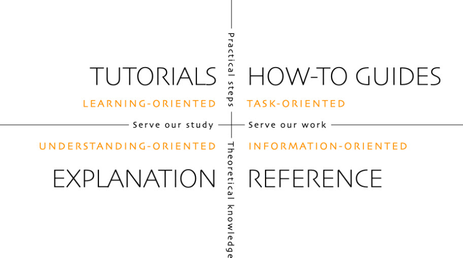
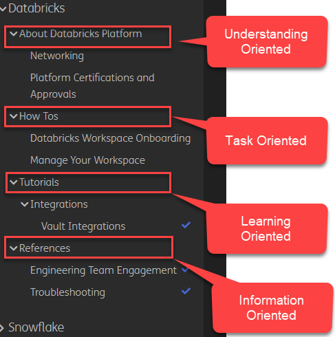

+++
title = "Documentation Strategy"
+++

## Documentation Strategy

Our document strategy is based on a framework called Diátaxis a greek word: dia ("across") and taxis ("arrangement").

Divide documentation into four categories: Understanding-Oriented, Task-Oriented, Information-Oriented, and Learning-Tutorial.

### Understanding-Oriented - Designs, architecture and other artifacts associated with the platform.

1. Explain, Provide context, Talk about the subject
2. Offer judgement and even opinions where appropriate.
3. Provide context that helps the reader.
4. Weigh up alternatives.
5. Unfold internal secrets, to help understand why something does what it does.
6. Don't instruct, or provide technical reference

### Task-Oriented - How tos, SOPs, and other procedural documentation.

1. Describe clearly the problem or task that the guide shows the user how to solve.
2. Use conditional imperatives. If you want x, do y. To achieve w, do z.
3. Don't pollute your practical how-to guide with every possible thing the user might do related to x.
4. Don't explain concepts.
5. Omit the unnecessary

### Information-Oriented - Technical reference documentation.
1. State facts about the subject and its behavior.
2. List commands, options, operations, features, flags, limitations, error messages, etc.
3. Provide warnings/important notes where appropriate.
4. Be consistent and descriptive.

### Learning-Tutorial - Learning material, training, and other educational documentation.
1. Describe what the learner will accomplish.
2. No room for ambiguity or doubt.
3. Provide minimal explanation of actions in the most basic language possible. Link to more detailed explanation.
4. Give your learner clear expectations.
5. Give your learner plenty of clues to help confirm they are on the right track and orient themselves.
6. Describe (and admire, in a mild way) what your learner has accomplished.

## Organizing the documentation

Here is a good example of how to organize the documentation:

You wont need a new category outside the 4 categories above. Try to fit your content into one of the 4 categories above.

## References   
Read more about the documentation strategy here:
https://diataxis.fr/