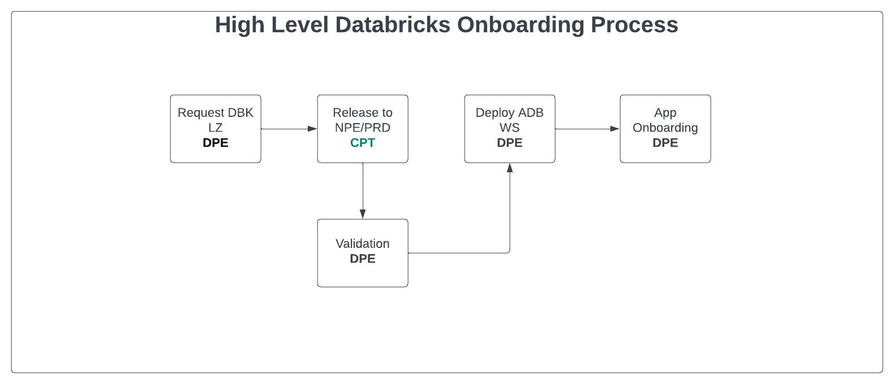

+++
title = "Databricks Workspace Onboarding Process"
+++

## Overview

This is an High Level Guide for onboarding to Databricks Workspace. It is intended for Data Platform Engineers.

## **Steps to onboarding to Databricks Workspace**

Here is a high level overview of the steps to onboarding to Databricks Workspace. Workspace and App onboarding can happen at the same time. Alkira is no longer required. 
> Diagram Update TBD.

### **Creation of Databricks Landing-zone**

1. Ascent Team creates the new Databricks Landing TF/definition file in GitHub in the respective LOB App Foundation repo.
     
2. DPE Team reviews and approves the Pull Requests. CPT reviews the Pull Requets and approves the PRs.
   
3. Ascent/DPE Team validates the plan in TFE and notifies the CPT Team for approval.
   - [PR Teams channel](https://teams.microsoft.com/l/channel/19%3ac8a2ff71781f4ef7b2c740f27c13598f%40thread.tacv2/Pull%2520Requests?groupId=362fd529-d3f1-4d7f-b56c-2454639d3c2a&tenantId=56c62bbe-8598-4b85-9e51-1ca753fa50f2)

4. CPT Team reviews/approves/request change to the PR.
   - PRs are reviewed daily. Provide 24 hours for review/approval.

5. Ascent Team merges the PR and validates the plan in TFE.

6. Weekly release is scheduled by CPT Team.
   - Release for NPE is scheduled on Mondays and Tuesdays.
   - If release fails the Ascent/DPE Team will be notified and will be responsible for fixing the issue and creating the PR again.
   - Failed releases should'nt have to wait for the next release cycle.
   
7. Once released DPE team can now deploy the Databricks workspace and application.