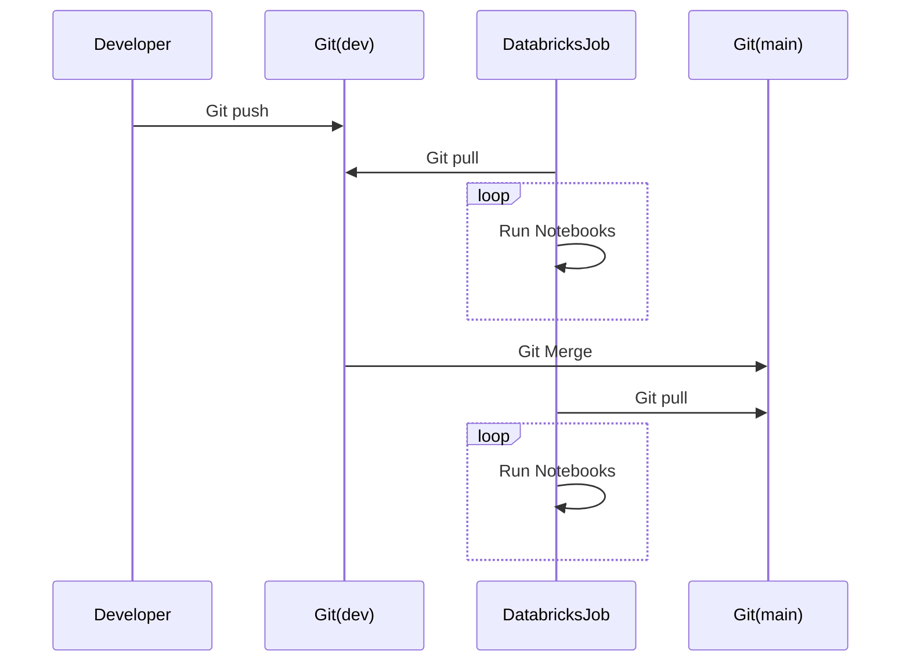
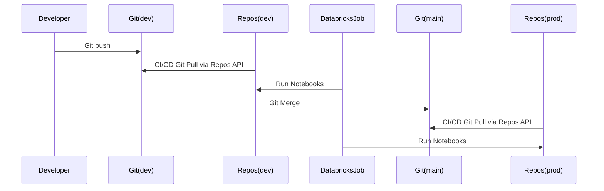
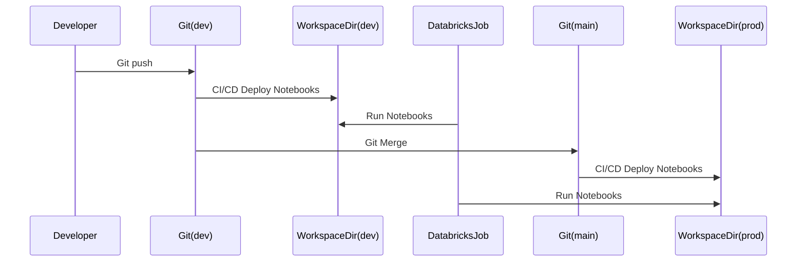

+++
title="Methods to Deploy Databricks Notebooks/Jobs"
+++

## Overview

Many teams desire the ability to deploy Databricks notebooks through CI/CD pipelines and Github actions. There are multiple methods available to deploy Databricks notebooks and jobs. This page will cover some of these methods, along with their pros and cons. Additionally, we will provide our recommendation on the best method to deploy Databricks notebooks and jobs.

## Methods

### 1. Using Github/Azure DevOps repo pull (Recommended)

This is the simplest and cleanest method of all. In this method, we will create a Databricks job that will pull the notebooks from the Github/Azure DevOps repo and run them.

There are no additional CI/CD setups required to achieve this, and all the touchpoints such as the git repo, workspace, and notebooks are isolated. There is no complex token management
required either.

### Pros

1. Simple and no additional CI/CD setup required.
2. No complex credential management required.
3. All the touchpoints are isolated.

### Cons

1. Collaboration is difficult as all developers work in silo within their own branch.
2. Code review can be difficult as most reviews happen in Github and not in Databricks Workspace.

### Resources
If you do prefer this approach, we have built a github action to perform the github token sync for your service principal.
Refer to the read me in [databricks-spn-git-setup-action](https://github.com/Cloud-3-0-EMU/data-platform-eng-actions/tree/main/databricks-spn-git-setup-action)

### Dependencies

1. The actor who is deploying the notebooks (typically Azure Service Principal) needs to set up a git token in the Databricks workspace.
2. Downtime of Github/AzureDevOps will impact Databricks jobs.

## 2. Using Repos API

Databricks offers the Repos API to manage the notebooks in the workspace. We can also use this API to pull the notebooks from git as part of the CI/CD pipeline. Refer to the [Databricks Repos API documentation](https://docs.databricks.com/dev-tools/api/latest/repos.html) or [Databricks Repos](https://www.databricks.com/product/repos) for more details.

> If you do prefer this approach, we have built the a template repo https://github.com/Cloud-3-0-EMU/databricks-template-repo to help you get started.

### Pros

1. Collaboration is easy as all developers' work is available in the workspace under Repos.
2. Code review is easy as all the reviews/results can happen in the workspace.

### Cons

1. Additional CI/CD setup required to pull the notebooks from git.
2. Anyone having manage access can alter the notebooks in the workspace. Access Control needs to be governed properly.
3. Switching between release branches is difficult as you will have to create separate repos for each release.
4. Adding more notebooks to the workspace counts towards the storage limit of the workspace.

### Dependencies

1. The actor who is deploying the notebooks (typically Azure Service Principal) needs to set up a git token in the Databricks workspace.

## 3. Using Workspace API

This is a traditional way of CI/CD where you import notebooks from the git repo to the workspace and create folders under the workspace directory. You can then create a Databricks job to run the notebooks from the workspace directory. This is the least recommended method.

### Pros

1. Collaboration is easy as all developers' work is available in the workspace under Repos.

### Cons

1. Additional CI/CD setup required to pull the notebooks from git.
2. Anyone having manage access can alter the notebooks in the workspace. Access Control needs to be governed properly.
3. Folders and notebooks could eventually grow and become unmanageable. It's possible that you end up importing too many release folders or notebooks can become stale.

## Conclusion

While we don't dictate what method to use, we recommend using the first method as it is the simplest and cleanest method. Additionally, it requires no additional CI/CD setup and has isolated touchpoints. However, it's important to consider the pros and cons of each method and choose the one that best suits your team's needs.
