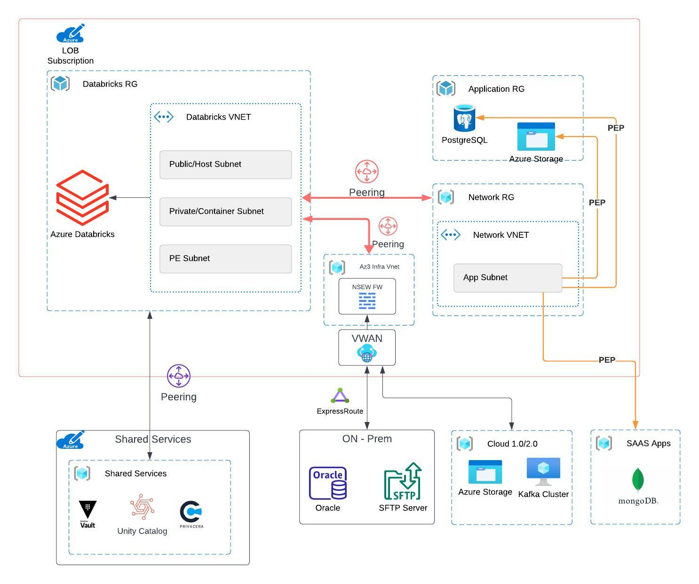
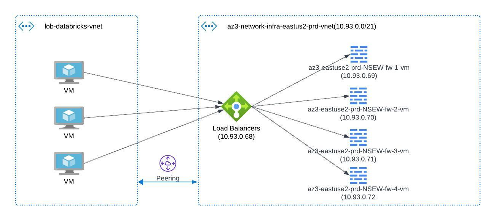

+++
title = "Networking"
+++

## Change Summary

- 5/25/23  - Major overhaul to the networking design. Databricks network on RFC6598 IP behind a NAT gateway.
- 22/4/24  - Optimized Network for performance.
## Overview

Here is a high-level overview of the networking components in Databricks Workspace in Cloud 3.0.

Databricks workspace in cloud 3.0 resides on a dedicated landing zone and its own dedicated VNET. This is to ensure that the workspace is isolated from the rest of the application data and gives the ability to share the workspace with multiple applications.

This also means that the workspace requires Private Endpoints, VNET Peerings, and firewall rules to be configured to allow access to the workspace.

Networking in Databricks boils down to the following components:

1. RFC 6598 VNET CIDRs
2. NAT & Firewall Rules
3. Private Endpoints

### RFC 6598 VNET CIDRs

RFC 6598 defines a block of IPv4 addresses that are reserved for use within private network environments. Specifically, the range of addresses defined in RFC 6598 is 100.64.0.0/10.

These addresses are designed to be used by service providers (in our case Azure) and organizations that need to allocate private IP addresses to their customers or employees. This allows them to use private addresses in their internal networks without the risk of conflicting with public IP addresses that are already in use on the internet.

Our networking team will allocate this IP range for our Databricks workspaces.

### Firewall Rules

Databricks Network in Cloud 3.0 is behind Cloud 3.0 Azure Firewall. NAT rules are applied to avoid IP conflict in the Cloud 3.0 NSEW Azure Firewalls 

 
While adding new firewall rules, you should request the following Source Address Group(s) in your go/firewall requests

{}
Instead of the source ip, specify the following source address group. This is preconfigured will the respective databricks cloud 3.0 vnets.
{}

| Source         | Environment|
| -------------- |-------------
| cld3-databricks-prod-fw-rules (address group) |Prod
| cld3-databricks-non-prod-fw-rules  (address group) | Non-Prod

{}
Until all workspaces are migrated to NSEW firewalls, you would still need to open firewall for the NAT IP Range. All workspaces will be migrated by end of May 2024
{}

If your workspaces is not yet moved to the new architecture, you would need to open the firewall with the following Source IP range

**Following are the IP addresses that are used for NAT rules**

| IP Range       | Description               | Environment |
| -------------- | ------------------------- | ----------- |
| 10.218.4.0/22  | NPE East US2 NAT Range    | NPE         |
| 10.218.0.0/24  | NPE East US2 VNET for NAT Hub | NPE     |
| 10.219.4.0/22  | NPE Central US NAT Range  | NPE         |
| 10.219.0.0/24  | NPE Central VNET for NAT Hub | NPE     |
| 10.218.132.0/22| Prod East US2 NAT Range   | Prod        |
| 10.218.128.0/24| Prod East VNET for NAT Hub | Prod      |
| 10.219.132.0/22| Prod Central US NAT Range | Prod        |
| 10.219.128.0/24| Prod Central VNET for NAT Hub | Prod  |

For each region/environment, there are two IP ranges - Both IPs should be asked to allow when setting up FW rules.

Any on-prem resource or resources that do not support Private Endpoints such as a load balancer, will need a firewall rule to allow access to the cluster.

### Private Endpoints

Application resource groups created in Cloud 3.0 subscriptions will come with a network VNET and an application-specific Subnet. This will be available in the document provided to you during onboarding or in the cpt toolbox (`go/cptoolbox`). Any resource that Databricks jobs need access to, should be able to create a Private Endpoint to the application subnet. 

> As per the current architecture, if PEs are not created in the Databricks VNET, traffic will be routed through the firewall. This may potentially cause performance issues. Please reach out for consultation if you are unsure about the networking design.

### Disaster Recovery

Databricks currently does not have regional redundancy for their `Unity Catalog` control plane and the metastore. This is expected by Q2 of 2024. However, we recommend to deploy your code thru CI/CD to workspaces in both east-us2 and central region.

## Troubleshooting
We have also created a notebook to help you troubleshoot connectivity issues. Refer to the Troubleshooting section in this wiki for more details.