+++
title = "Manage Your Databricks Workspace Secrets"
+++

The secrets in a databricks workspace can be managed using the REST API or databricks CLI. This document illustrates the databricks secrets management using the REST API and postman.
- [Install Postman](#install-postman)
- [Disable SSL Verification](#disable-ssl-verification)
- [Import REST API's](#import-rest-apis)
- [Create Databricks PAT](#create-databricks-pat)
- [Authorize API's](#authorize-apis)
- [List secret scopes](#list-secret-scopes)
- [Add a secret to secret scope](#add-secrets-to-secret-scope)
- [Delete a secret from secret scope](#delete-secrets-from-secret-scope)
- [Troubleshooting](#troubleshooting)

## Install Postman

Postman can be installed from [go/software](https://software.humana.com/results?mainSearch=%22postman%22). Open the postman after it is installed, skip the login and go to the app.

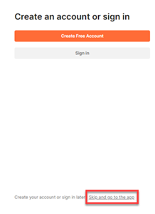

## Disable SSL Verification

The SSL verification must be disabled in the postman. If it is not disabled then you may see an error like `SSL Error: Unable to get local issuer certificate`. To disable SSL goto File -> Settings 

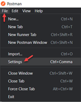

Under the General settings turnoff the SSL certificate verification.

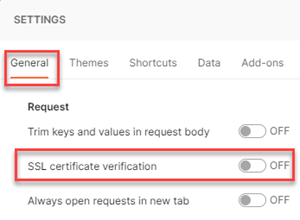

## Import REST API's

The postman collection required for managing the databricks secrets is available [here](https://github.com/Cloud-3-0-EMU/dbk-utils/blob/main/postman/Cloud%203.0%20Databricks%20APIs%20-%20Non%20Prod%20Playground.postman_collection.json). It is a simple json file, download it and go back to the postman tool. 
1. Click the `Import` button and it will open a pop-up and then click the `Upload Files` button in the pop-up.

    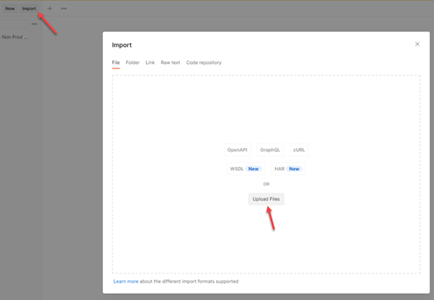

2. Browse to the downloaded postman collection location, select it and finish the upload. This is how the imported API's would look like once the import is completed.

    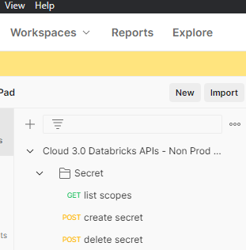

## Create Databricks PAT

The requests for managing the databricks secrets must be authorized and for the authorization, databricks personal access token (PAT) can be used. To create a PAT follow the below steps.
1. Open the databricks workspace in a browser and click on `yourusername@humana.com` on the right side. Now, click the `User Settings`.

    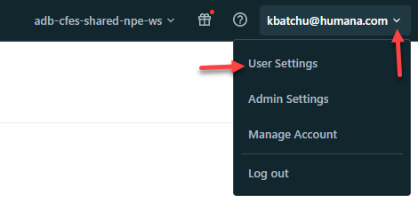

2. In the `User Settings` go to `Access tokens` and click the `Generate new token` button.

    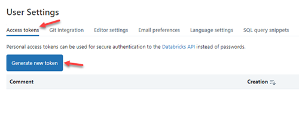

3. Give a name and Lifetime to the token and click Generate. Copy the generated token and store it safely. For a non-expiring PAT leave the Lifetime field blank.

    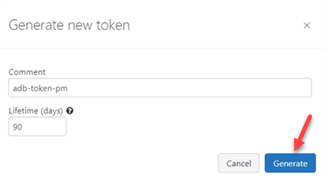

    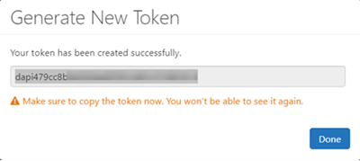

## Authorize API's

The API's must be authorized to manage the databricks secrets and to do that follow the below steps.

1. Go to the postman and click on the top folder of the previously added collection. Select Authorization tab and choose `Bearer Token` as the authorization type. Copy the token generated in the previous step and paste it in the text area beside Token and save it.

    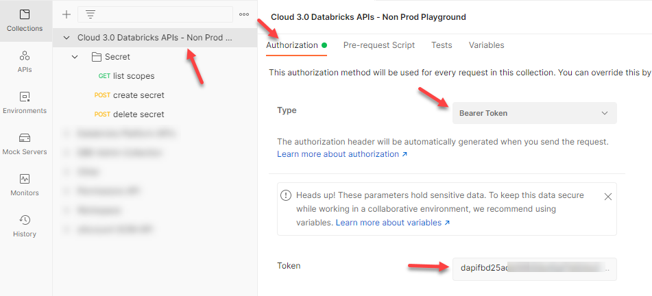

2. Click the sub-folder `Secret`, select Authorization tab and set authorization type as `Inherit auth from parent` and save it.

    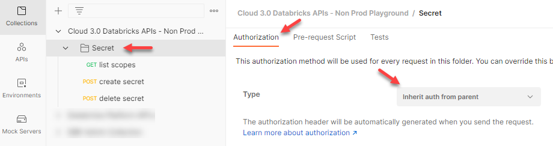

3. Select `list scopes`, `create secret` and `delete secret` one after another and set the authorization type as `Inherit auth from parent` for each one of them and save it.

    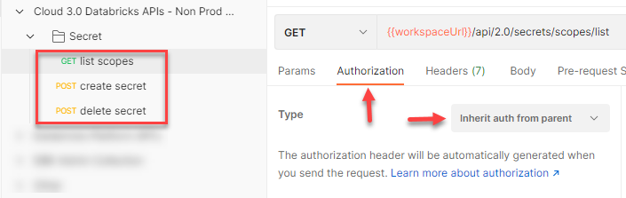

## List Secret Scopes

When the application is onboarded into databricks a secret scope with your application name is created and new secrets should be added to this scope. The list scopes API will return the list of all secrets in the shared databricks workspace. Identify the secret scope with your application name and make a note of it. Follow the below steps to invole the API.
1. Select the list scopes request.
2. Make sure `GET` is selected.
3. Replace the `{{workspaceUrl}}` with your databricks workspace URL. Here is a sample request URL after the actual workspace URL is added `https://adb-1597811892156198.18.azuredatabricks.net/api/2.0/secrets/scopes/list`.
4. Make sure `none` is selected under the `Body` of the request.
5. Click the `Send` button to get the list of all scopes.
6. The existing secret scopes in the workspace will be displayed.

    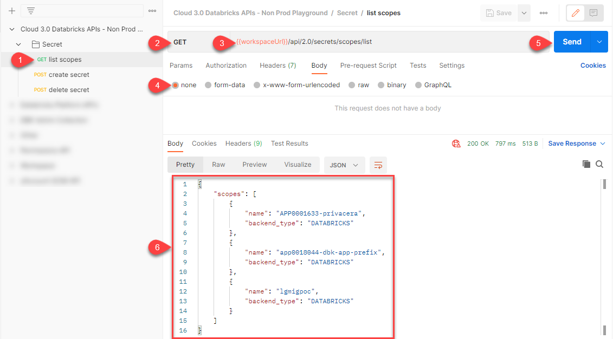

## Add secrets to secret scope

A secret can be added to the application secret scope using the below steps.
1. Select create secret request in the postman.
2. Make sure the request is a `POST`.
3. Replace the `{{workspaceUrl}}` with your databricks workspace URL. Here is a sample request URL after the actual workspace URL is added `https://adb-1597811892156198.18.azuredatabricks.net/api/2.0/secrets/put`.
4. Click on the request `Body`.
5. Select `raw`.
6. Choose `JSON` as the type.
7. Update the `scope`, `key`, `string_value`.
    - `scope`: This is the secret scope to which the secret should be added. It is typically your application scope.
    - `key`: This is like a name to the secret you are creating. The secret is accessed in the application using this key. This should be unique.
    - `string_value`: This is the actual secret you want to create.
8. Click the send and that will send the request to create the given secret.
9. If the secret is created successfully then the response code will be in 200's.

    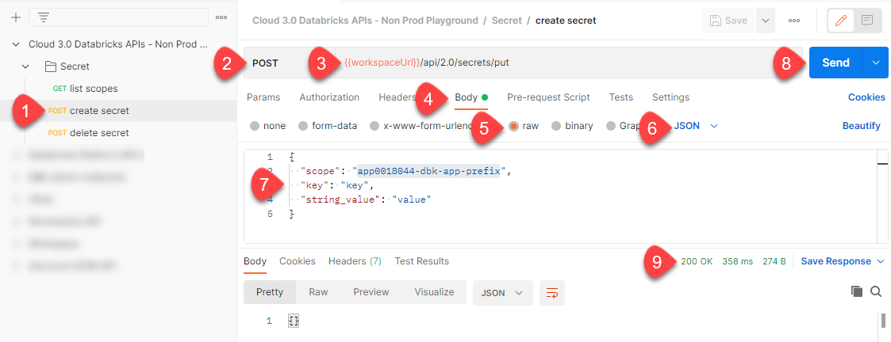

## Delete a secret from secret scope

A secret can be deleted from the application secret scope using the below steps.
1. Select delete secret request in the postman.
2. Make sure the request is a `POST`.
3. Replace the `{{workspaceUrl}}` with your databricks workspace URL. Here is a sample request URL after the actual workspace URL is added `https://adb-1597811892156198.18.azuredatabricks.net/api/2.0/secrets/delete`.
4. Click on the request `Body`.
5. Select `raw`.
6. Choose `JSON` as the type.
7. Update the `scope` and the `key`.
    - `scope`: This is the secret scope from which the secret should be deleted.
    - `key`: Name of the key that has to be deleted from the scope.
8. Click the send and that will send the request to delete the given secret.
9. If the secret is deleted successfully then the response code will be in 200's.

    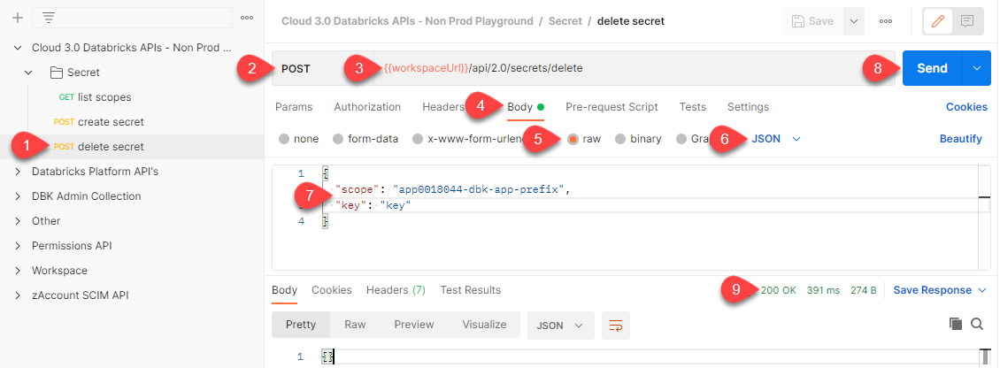
