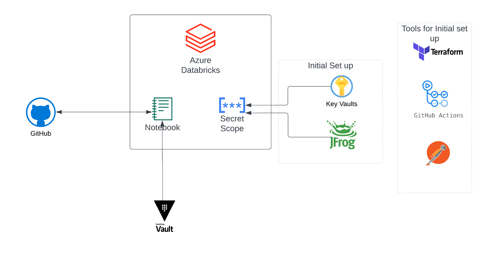

+++
title = "Keeping your Workspace Portable"
weight=2
+++

## Overview 
When working with Databricks, it is important to consider the portability of workspace objects such as code, secrets, and libraries. The main reason for this is that it allows for more flexibility in managing these objects across environments, regions or even cloud providers.

By ensuring that these objects can be *easily moved* between workspaces and projects, users can avoid being tied to a specific workspace. This makes it *easier to manage* code and data pipelines across different environments, which can be particularly useful when planning for BC/DR situations.

## Best practices for Portable Workspace

Consider this diagram, the initial set up should only require setting up the 2 secrets pairs in your secret scope. 

At that point, the workspace has access to Hashicorp Vault and can retrieve the secrets from there and initialize the secret scope. All code is set up in Github and CI/CD pipeline is set up to deploy the code to the workspace. This ensures that the workspace is portable and can be *easily moved* to another workspace or environment.

Let's dive into the details of each of these components.

### Initial Setup - Secrets

Initial set up involves setting up the app service principal and JFROG API keys. These keys can be added to secret scope in multiple ways.

1. CI/CD Pipeline - The pipeline can be set up to add the secrets to the secret scope. This is the *recommended approach*. Here is a sample repo that does this for you
   - https://github.com/Cloud-3-0-EMU/databricks-template-repo
2. Using [Terraform](https://registry.terraform.io/providers/databrickslabs/databricks/latest/docs/resources/secret_scope)
3. Using the [Secrets CLI](https://docs.databricks.com/dev-tools/cli/secrets-cli.html)
4. Using [Postman](content/databricks/how-tos/secrets-management.md)

### Git Repos

All code should be stored in Github or Azure DevOps Repo. To begin with, create a repo in Github/ADO with the appropriate branches and clone the repo to your workspace. Developers use standard development practices to create feature branches, merge code and create pull requests.

> Before you begin, you will have to added your git credentials to your workspace. Go to User Settings - Git Integration and configure your git credentials.

### CI/CD Pipeline

We have created a sample repo to get you started. 

> https://github.com/Cloud-3-0-EMU/databricks-template-repo

This repo contains a sample pipeline that can be used to deploy code to your workspace. The pipeline is set up to deploy code to the workspace when a pull request is merged to the main branch.

### JFROG Artifactory

As a part of the CI/CD pipeline, JFROG secrets are setup in your secret scope. You can use these secrets to connect to JFROG and download the libraries that you need.

To make it easier, we have also included artifactory credentials in our platform level cluster policies. However as a best practice, we recommend that you create your own artifactory credentials in your secret scope and use them in your cluster init script or notebooks.

### Hashicorp Vault

Hashicorp Vault is Humana's primary secrets management tool that can be used to store secrets such as database credentials, API keys, and certificates. You can use retrieve and use secrets in primarily 2 different ways.

#### 1. Copying credentials to the workspace secret scope.

In this method you would use a common set up notebook where you copy all the required credentials from Hashicorp Vault to the workspace secret scope. This notebook is invoked as the first step of your ETL pipeline or as a daily job. This ensures that the credentials are always up to date and you don't have to invoke Vault every time you need a secret.

#### 2. Using Hashicorp Vault API

In this method, you would use the Hashicorp Vault API to retrieve the secrets from Vault every time you need to get a secret. There are downsides using this approach, for instance you cannot use this in spark variables as it would print as clear text in log4j logs. The other issue with this approach is that users could accidentally print the secrets in the notebook.

#### Example 
Here is a sample implementation of accessing vault.
https://github.com/Cloud-3-0-EMU/databricks-template-repo/blob/npe/vault.py

> Make sure you are using the right url for the vault. The url is different for each environment. Learn more about at [go/vaultdocs](https://go.humana.com/vaultdocs)
