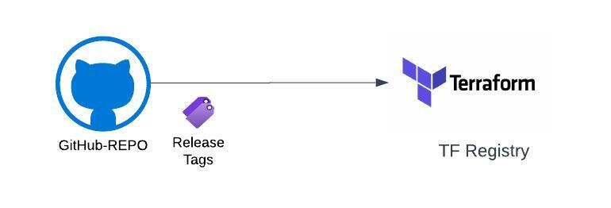

+++
title = "Work with IAC Working Repo"
+++

## Overview

IAC working repo is a repository that is used to create and manage terraform modules. This repo is managed by Serivce Enablement team to create and manage terraform modules. 

There is a ton of automation that is already in place to create and manage terraform modules.

But before we get into the details, lets understand how terraform modueles are published to the registry.



Every module is associated with a github repo that named something similar to "terraform-provider-module-name". The git repo is set up to enable release tags. Each release is associated with a tag and this tag becomes the version of the module.

IAC Working Repo takes care of publishing the git repo and setting up the release tags.

## Creating a New Terraform Module

The inital set up is usually done by the SE team. The inital set up includes a new "terraform" repo and a "template" repo. Work with the SE team on the naming and repo permissions. 

Here are the steps to create a new terraform module:

1. Clone the iac working repo
    ```bash
    git clone https://github.com/Cloud-3-0-EMU/iac-working-repo
    ```
2. Create a new folder with the name of the module. For example, if the module name is "terraform-provider-module-name", create a folder named "module-name" under /azure/cloud3 or based on the cloud provider.

3. Create a new branch and switch to the branch
    ```bash
    git checkout -b feature/module-name
    ```
4. Create 2 workflow file in the .github/workflows one for sync and another one to run the terraform. Here is a template to duplicate and edit the values. Make sure to update the values in the template with the correct values.
   a) Sync WF: https://github.com/Cloud-3-0-EMU/iac-working-repo/blob/main/.github/workflows/azure_storage_sync.yml
   b) Terraform WF:https://github.com/Cloud-3-0-EMU/iac-working-repo/blob/main/.github/workflows/azure_storage_tfe.yml

5. Build your template and module. Push the changes and create a PR.
   ```bash
    git add .
    git commit -m "Initial commit"
    git push origin feature/module-name
    ```
6. Create a PR and get it reviewed. Ensure that you add description that the Module is a `new release`. This is important as the automation will create a new release tag and publish the module to the registry.

## Updating an Existing Terraform Module

Here are the steps to update an existing terraform module:

1. Clone the iac working repo
   ```
    git clone https://github.com/Cloud-3-0-EMU/iac-working-repo
    ```
2. Create a new branch and switch to the branch
   ```bash
    git checkout -b feature/module-name
    ```
3. Update the module and push the changes
   ```bash
    git add .
    git commit -m "Initial commit"
    git push origin feature/module-name
    ```
4. Update your change.md with the changes you made.
5. Update your readme.md with the module features and usage.
6. Create a PR and get it reviewed. Ensure that you add description that the Module is an `patch release` or `minor release` or a `major release`. 


## Reviewing a Terraform Module

Approvers can follow this checklist to review a terraform module:

```markdown
[ ] Module is created in the correct folder structure.
[ ] A template is created along with the module.
[ ] The workflow successfully ran and the apply is complete.
Note: Plan alone is not considerd as a successful test.
[ ] Is the resource created and usable.
[ ] Module has readme.md that explains the usage of the module.
[ ] Module has change.md that explains the changes made to the module.
```

## Publishing a Terraform Module

Merging the PR will trigger the automation to publish the module to the registry. The automation will create a new release tag and publish the module to the registry.

4 types of comments are accepted during PR merge:

```new release``` - This will create a new release tag and publish the module to the registry. 1.0.0 is the default version.

```patch release``` - This will create a new patch release tag and publish the module to the registry. Version will be incremented by 0.0.1.

```minor release``` - This will create a new minor release tag and publish the module to the registry. version will be incremented by 0.1.0.

```major release``` - This will create a new major release tag and publish the module to the registry. version will be incremented by 1.0.0.