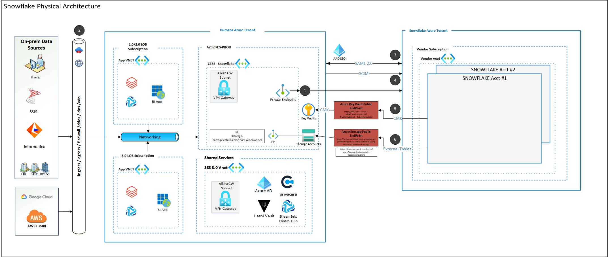
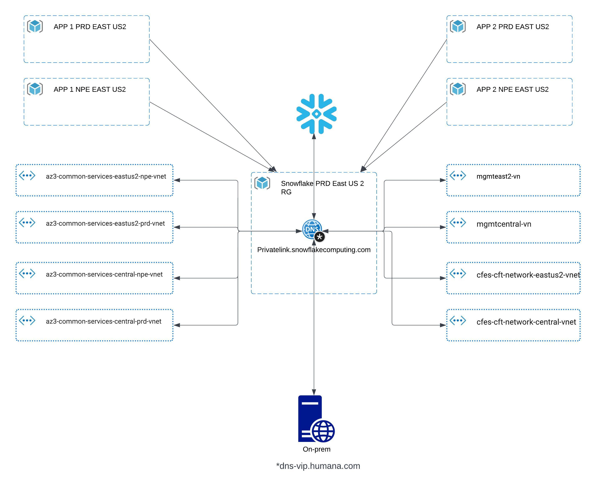

+++
title = "Platform architecture"
+++

## Snowflake Architecture

Humana's Snowflake primary account is set up behind a private endpoint, and all traffic include production and non-production data is routed to snowflake via this private endpoint. The CFES Production tenant in the house for all infrastructure components for snowflake. 

## Private DNS Zone

Given the nature of snowflake account setup, the private dns zone is unique. There is a single private dns zone for all snowflake accounts and locally created in the snowflake tenant. This private dns zone is linked with all the cloud 1.0/2.0 and 3.0 network hubs.

